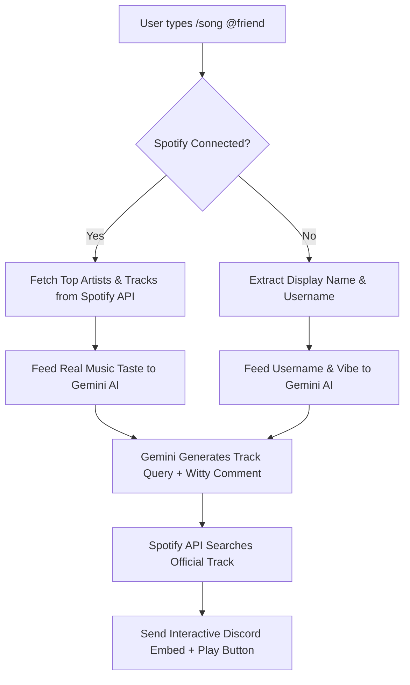

<div align="center">

# 🐘 Junky — AI & Spotify Powered Discord Music Bot

<p align="center">
  <strong>Personalized AI music suggestions, playful roasts, and seamless Spotify integration right inside Discord.</strong>
</p>

<p align="center">
  
  
  
  
</p>

</div>

---

## 🌟 Overview

**Junky** is a next-generation Discord music companion that combines **Google Gemini AI** and the **Spotify Web API** to deliver hyper-personalized song recommendations and hilarious commentary for anyone in your Discord server.

Users can securely link their Spotify accounts using OAuth, allowing Junky to analyze their real listening habits (top artists & top tracks) to deliver custom recommendations — or roast their taste with witty one-liners!

---

## ✨ Key Features

- 🧠 **AI-Powered Recommendation Engine**: Powered by Google Gemini to analyze musical vibes, user personalities, or usernames to pick the perfect track.
- 🔗 **Seamless Spotify OAuth (`/connect`)**: Users can link their personal Spotify accounts privately in one click without exposing credentials.
- 📊 **Real Listening History Analysis**: Fetches user's actual **Top 5 Artists** and **Top 5 Tracks** from Spotify to craft tailored suggestions.
- 🎭 **Dual Intelligence Modes**:
  - **Personalized Mode** (Connected): Curates tracks based on the user's authentic Spotify listening data.
  - **Vibe/Roast Mode** (Fallback): Cleverly analyzes usernames or nicknames to pick ironic or funny tracks.
- 🎧 **Interactive Rich Embeds**: Displays high-resolution album artwork, artist credits, AI commentary, and a direct **"▶ Play on Spotify"** button.
- ⚡ **Instant Command Sync**: Automatic guild-level synchronization ensures all slash commands appear immediately in your server.

---

## 🚀 How It Works



---

## 🎮 Slash Commands

| Command | Description | Visibility |
| :--- | :--- | :--- |
| `/song @user` | Asks AI to pick and present a song for the tagged user | Public in Channel |
| `/connect` | Generates a private OAuth button to link your Spotify account | 🔒 Ephemeral (Only You) |
| `/disconnect` | Unlinks your Spotify account and deletes stored tokens | 🔒 Ephemeral (Only You) |
| `/sync` | Force-syncs slash commands (Bot Owner only) | 🔒 Ephemeral (Only You) |

---

## 🛠️ Tech Stack

- **Language**: Python 3.10+
- **Bot Framework**: [discord.py](https://github.com/Rapptz/discord.py) (Slash Commands / Interaction API)
- **AI Model**: [Google GenAI SDK](https://github.com/google-gemini/generative-ai-python) (`gemini-flash-latest`)
- **Music API**: [Spotify Web API](https://developer.spotify.com/documentation/web-api) (OAuth 2.0 Authorization Code Flow + Client Credentials)
- **Local Web Server**: [aiohttp](https://github.com/aio-libs/aiohttp) (Async OAuth callback handler on port `8888`)

---

## 📦 Setup & Installation

### 1. Prerequisites
- Python 3.10 or higher
- A [Discord Developer Application](https://discord.com/developers/applications) & Bot Token
- A [Spotify Developer Account](https://developer.spotify.com/dashboard) (Client ID & Client Secret)
- A [Google AI Studio API Key](https://aistudio.google.com/apikey) (Free)

### 2. Clone the Repository
```bash
git clone https://github.com/your-username/discord-music-bot.git
cd discord-music-bot
```

### 3. Create a Virtual Environment & Install Dependencies
```bash
python -m venv venv

# Windows:
.\venv\Scripts\activate

# macOS / Linux:
source venv/bin/activate

pip install -r requirements.txt
```

### 4. Configure Environment Variables
Copy `.env.example` to `.env`:
```bash
cp .env.example .env
```
Fill in your credentials inside `.env`:
```env
DISCORD_TOKEN=your_discord_bot_token_here
GEMINI_API_KEY=your_google_gemini_api_key_here
SPOTIFY_CLIENT_ID=your_spotify_client_id_here
SPOTIFY_CLIENT_SECRET=your_spotify_client_secret_here
SPOTIFY_REDIRECT_URI=http://127.0.0.1:8888/callback
```

### 5. Configure Spotify Developer Dashboard
1. Go to your [Spotify Developer Dashboard](https://developer.spotify.com/dashboard).
2. Select your App and click **Settings**.
3. Under **Redirect URIs**, add:
   ```
   http://127.0.0.1:8888/callback
   ```
4. Click **Save**.

### 6. Run the Bot
```bash
python bot.py
```

---

## 🔒 Privacy & Security

- **Safe Token Handling**: All user access and refresh tokens are stored locally in `user_tokens.json`, which is permanently excluded via `.gitignore`.
- **Ephemeral Authorization**: OAuth authorization URLs are delivered as Discord Ephemeral messages, meaning only the calling user can ever see or click their personal auth link.
- **Auto-Refresh**: Access tokens are automatically refreshed in the background without prompting users to log in again.

---

## 📄 License

This project is licensed under the [MIT License](LICENSE).
